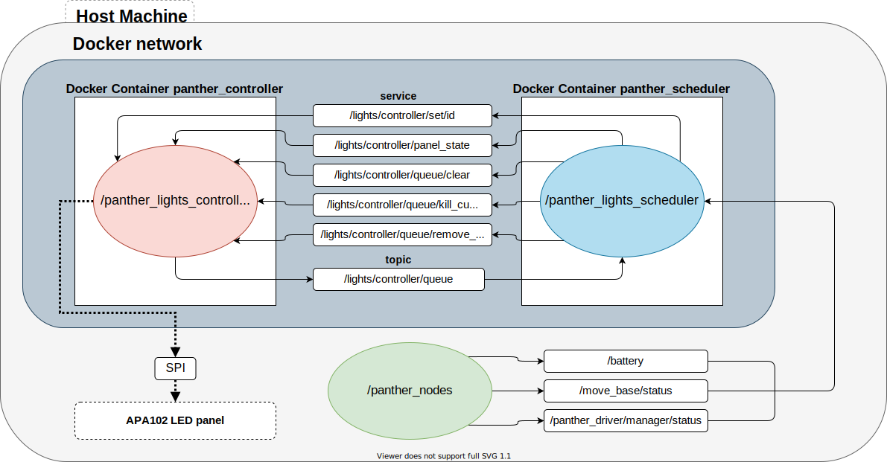

# panther_lights
Dockerized nodes used to control Panther LED panels and display it's status. Package nodes:

- [`panther_lights_controller`](./panther_lights_controller) - ROS node controlling LED panels connected robot.

- [`panther_lights_scheduler`](./panther_lights_scheduler) - ROS node deciding which animation to show on the LED panel.


Currently supported platforms by `panther_lights_controller`:
- *APA102* based LED panel
- virtual LED panel implemented with Matplotlib.


## Prebuild images
Prebuild images are available on dockerhub:
- [`panther-lights-controller`](https://hub.docker.com/r/husarion/panther-lights-controller/tags?page=1&ordering=last_updated)
- [`panther-lights-scheduler`](https://hub.docker.com/r/husarion/panther-lights-scheduler)

## Building a Docker image
#### panther_lights_controller
```bash
cd panther_lights_controller/panther_lights_controller_base
sudo docker build -t husarion/panther-lights-controller:base .
```
For given controller implementation run:
```bash
cd ../platforms/panther_lights_controller_<platform>
sudo docker build -t husarion/panther-lights-controller:<platform> .
```

#### panther_lights_scheduler
```bash
cd panther_lights_scheduler/panther_lights_scheduler
sudo docker build -t husarion/panther-lights-scheduler .
```

## Examples
Before running *docker-compose* build `panther_lights_controller:base` docker image from previous section
### GUI based demo using Matplotlib
```bash
cd examples/matplotlib_gui
xhost local:root
docker-compose up --build
```
### Raspberry Pi
```bash
cd examples/raspberry_pi
docker-compose up --build
```


### Docs
For more detailed instructions:
- [`panther_lights_controller` node description](./panther_lights_controller/README.md)
- [`panther_lights_controller` defining own animations](./docs/README.md)
- [`panther_lights_controller` custom panel controller](./panther_lights_controller/platforms)
- [`panther_lights_scheduler` node description](./panther_lights_scheduler/README.md)


### Architecture
<div style="text-align:center">

</div>
